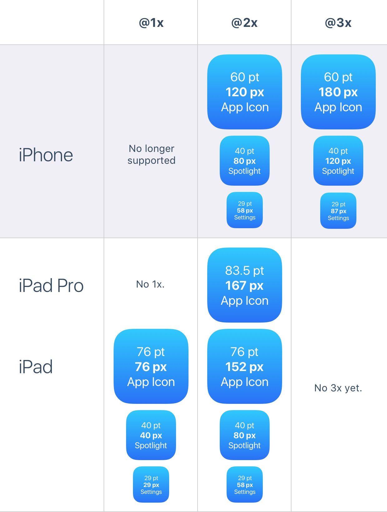

title: iOS-UIKit-Basic
date: 2016-01-16 17:37:56
category: "iOS"
tags: "UIKit"
---

## Points and Pixels

## iPhone Resolutions

## App Icon

## Colors

## Spacing and Alignment
一般约定8pt

## Status Bar
高：20pt 

## Navigation Bar
高：44pt
 
## Search Bar
高：44pt 字体大小：15 Cancel字体：17pt
  
## Toolbar
高：44pt 字体：17pt

## Tab Bar
高：49pt 字体大小：10pt

## Table View

## Collection View

## Modals
alert 对话框：270*176pt 标题：17pt 内容：13pt 按钮：17pt

## Picker
高：217pt

## Segmented Control
高：44pt 字体大小：13pt 内部高度：26pt

## Sliders
高：30pt 

## Progress

## Switch
高：31pt

## Stepper
94pt*29pt

